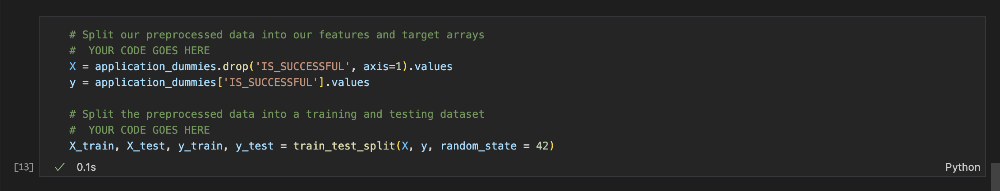
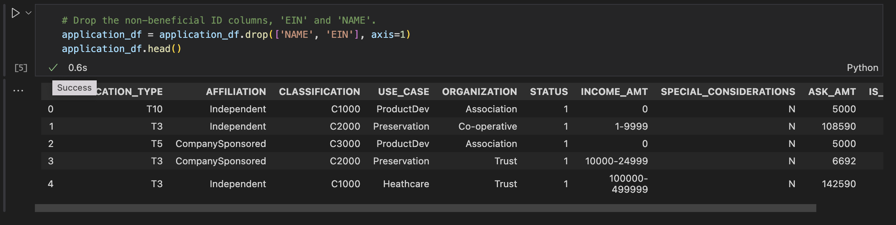
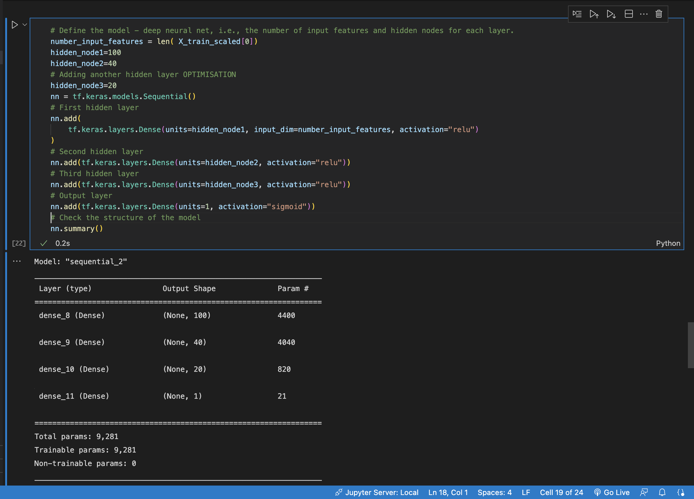
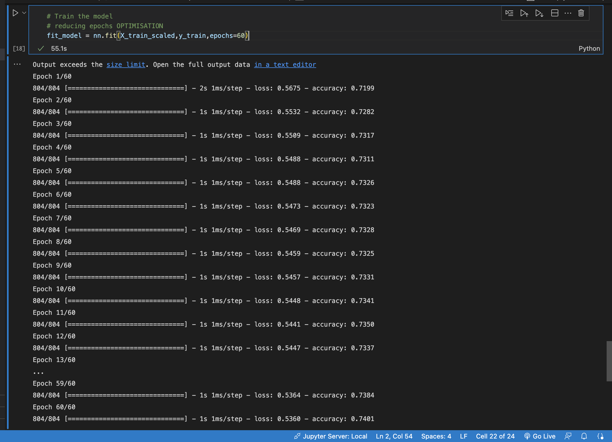
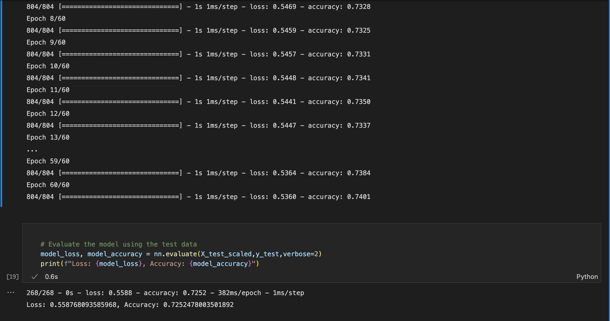
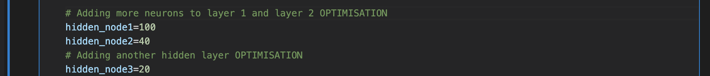
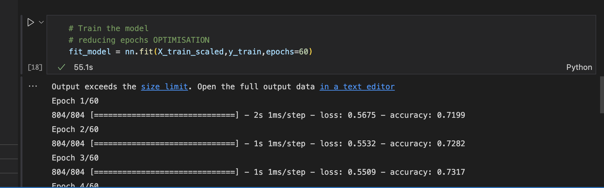

# deep-learning-challenge

# Report on the Neural Network Model
### Deep Learning Charity Funding Outcome Predictor Project using hyper-tuned Neural Networks.

## Overview:

I've created a tool for the  nonprofit foundation Alphabet Soup that can help it select applicants for funding with the best chance of success in their ventures. Using my knowledge of  machine learning and neural networks, I have used the features in the provided dataset to create a binary classifier that can predict whether applicants will be successful if funded by Alphabet Soup. We were set a target of 75% accuracy for our model.
From Alphabet Soup’s business team, I received a CSV containing more than 34,000 organizations that have received funding from Alphabet Soup over the years. Within this dataset are a number of columns that capture metadata about each organization, such as:

* **EIN** and **NAME**—Identification columns
* **APPLICATION_TYPE**—Alphabet Soup application type
* **AFFILIATION**—Affiliated sector of industry
* **CLASSIFICATION**—Government organization classification
* **USE_CASE**—Use case for funding
* **ORGANIZATION**—Organization type
* **STATUS**—Active status
* **INCOME_AMT**—Income classification
* **SPECIAL_CONSIDERATIONS**—Special consideration for application
* **ASK_AMT**—Funding amount requested
* **IS_SUCCESSFUL**—Was the money used effectively

 
## Results
### Data Preprocessing
- #### What variable(s) are the target(s) for your model?
    - the target variables of the model are: APPLICATION_TYPE, AFFILIATION, CLASSIFICATION, USE_CASE, ORGANIZATION, STATUS, INCOME_AMT, SPECIAL_CONSIDERATIONS, ASK_AMT and IS_SUCCESSFUL.
 
- #### What variable(s) are the features for your model?
    - The feature variable for this model was IS_SUCCESSFUL, as it was the feature set when splitting the data. And the goal of this tool was to dectect how successful each company is after receiving funding, thus the IS_SUCCESSFUL variable was set as the feature.
    - 
 
- #### What variable(s) should be removed from the input data because they are neither targets nor features?
    - The variables that were dropped are NAME and EIN as they were used for identification and thus there was no need for the tools analysis.
    - 
 
### Compiling, Training, and Evaluating the Model
- #### How many neurons, layers, and activation functions did you select for your neural network model, and why?
    - I had used 100 neurons in my first layer, 40 in my second, and 20 in the third layer. This is because in the original I used 80 in the first layer and 30 in the second. So increasing the neurons and layers was an attempt at increasing the accuracy of the model. The activation function I had used for my neural network model was relu and sigmoid for the output layer, these were the functions I had the most success with.
    - 
 
- #### Were you able to achieve the target model performance?
    - The target performance was to have it operate at 75% accuracy. Unfortunately even with 3 attempts at optimisation I was still not able to increase the accuracy from 72% and 74% on the trained data.
    - 
    - 
 
- #### What steps did you take in your attempts to increase model performance?
    - I had tried to optimise the performance by adding more neurons hidden layers and reduce the epochs.
    - 
    - 
### Summary
Overall, the model took the important and usable data then with some cleaning and organising then I had created a data set to train by and I had used machine learning. However the model was not entirely accurate at only 72% and suffered data loss. Another model or tool that could have been helpful is a supervised machine learning model as it can be trained on the data provided and used to classify the data as opposed to the deep learning model used.